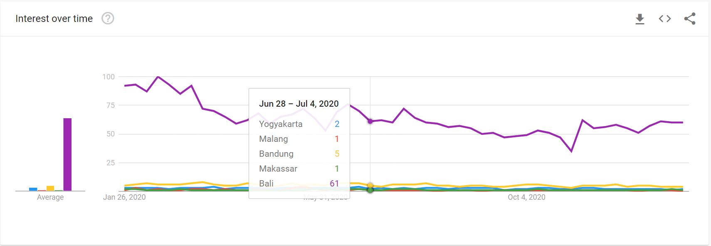
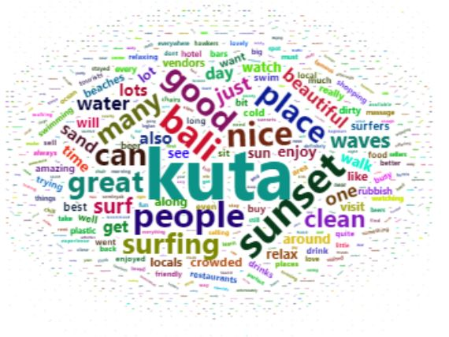

# BeautIndonesia

**BeautIndonesia** is an application designed for local or foreign tourist who wants to plan their holiday trip to Indonesia without any background knowledge of Indonesia tourism. In this application, we provide you some informations about destinations, destination's reviews, rules or norms, and booking applications to book your flight, hotel, and ticket in Indonesia. Those things will help you to plan your trip to Indonesia and enjoy the **Beautiful Indonesia**!

We will explain more about the application below, but if you want to see it directly, just check it out: (shiny app link)

## Table of Contents 
[1. Introduction](#Intro)

[2. Place Recommendation](#Place)

[3. Travel Recommendation](#Travel)

[4. Booking Applications](#Booking)

## Introduction
"*Indonesia*".. What is the first word pops out in your head when you read the word "Indonesia"? Maybe most of you will come up with the word "Bali". With this application, we hope that after this the first word pops out in your head when you read or hear about "Indonesia" is "*Beautiful*". We want to introduce the beauty of Indonesia to the people all around the world, especially those who want to experience new holiday trip, by making this app. All informations that we provide in this app are scraped from the sources we attached in the About Us section. Don't worry, we have combined the popular and anti-mainstream destinations as a whole package that will give you an amazing experience in the **Beautiful Indonesia**!

## Popular Places
In order to bring the trip recommendations for you, we have found out which places across Indonesia that are mostly searched through out Google. We gathered *interest over time* data of places in Indonesia from Google Trends and took 5 most popular places based on it as the recommendations for you. 

In this section, we provide the description about the places and the distribution map of the interest over time of places in Indonesia. Of course, to assure you to plan your trip to Indonesia, we provide some testimonials about Indonesia in the "Why Indonesia?" section.

## Trip Recommendations
This is the main section of **BeautIndonesia** where you can find the recommended destinations in each of the 5 most popular places in Indonesia that you found in the previous section. 

### 1. Route Optimization
The most important thing in any holiday trips is the road-time-saver. Of course, we want to spend shorter time in the road and longer time in the destinations. We make it easier for you by providing the route optimization map if you want to spend your entire day hoping from one to other destination places we recommended for you. This route optimization is done using Nearest Neighbor algorithm. The starting point is your hotel, so you know which destination is the farest and which one is the nearest from your lodging. We also made this feature so that you can decide which one is your destination in the first day, second day, and so on.

### 2. Destination Description & Travel Tips
Want to know more about the destinations? Choose one of the destinations and read the descriptions! We guarantee that you will be curious and want to start your trip to Indonesia as soon as possible. Before going any further, don't forget to read some travelling tips in your chosen place so you can relax and enjoy your holiday without dealing with any problems.

### 3. Reviews
We know that nothing can make you be less worry other than knowing how people feel when they went to the destinations we suggested. So, we made a word cloud and did sentiment analysis from the people's reviews. 

In the word cloud, the size of the words implies how many times they were written in the reviews. Of course, you can make your own judgement about the destinations from the words you see in this section. In addition, we also did sentiment analysis of the reviews to see what feelings they showed from the reviews they wrote. We don't favoring any parties, so we guarantee that you see honest reviews that we scraped from TripAdvisor.  
  

## Booking Applications
It is not complete if we only give you the recommended places, so we also provide you with 6 applications where you can book flight and hotel, or book your admission ticket to the destinations. In the Booking Applications menu, we also provide you the description of each apps and their ratings from Google Play Store, so it is up to you to choose which one you want to use. Moreover, we also provide you with hyperlinks to the Google Play Store in the application's name.

That's all about our application, go check it out and hope you enjoy **BeautIndonesia**!
